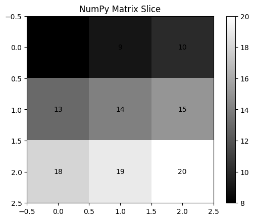

# Task 4

## 1. Implementations

For this task, I implemented 2D matrix slicing in Python using NumPy and in C. The main goal was to perform the same slicing operation in both languages and check whether they produce the same result.

The matrix size is not hard-coded. The user enters the number of rows and columns, and then enters the starting and ending positions for rows and columns.

### Python implementation

In Python, NumPy makes 2D slicing very simple. The main operation is:

```python
result = matrix[row_start:row_end, col_start:col_end]
```

The first part selects the rows and the second part selects the columns.

For example, if we have:

```text
1  2  3  4  5
6  7  8  9  10
11 12 13 14 15
16 17 18 19 20
21 22 23 24 25
```

and select rows `1` to `4` and columns `2` to `5`, the result is:

```text
8   9   10
13  14  15
18  19  20
```

The Python program also displays the sliced matrix as a grayscale image using Matplotlib.

### C implementation

C does not have NumPy-style matrix slicing, so I implemented it using nested loops.

The important part is:

```c
for (int i = row_start; i < row_end; i++) {
    for (int j = col_start; j < col_end; j++) {
        printf("%4d", matrix[i][j]);
    }
}
```

The program dynamically allocates the matrix based on the dimensions entered by the user. Therefore, the program is not limited to one specific matrix size.

## 2. Results

I tested the program using the following inputs:

```text
5
5
1
4
2
5
```

These inputs mean that I created a `5 x 5` matrix and selected rows `1` to `4` and columns `2` to `5`.

The original matrix was:

```text
1   2   3   4   5
6   7   8   9   10
11  12  13  14  15
16  17  18  19  20
21  22  23  24  25
```

The resulting sliced matrix was:

```text
8   9   10
13  14  15
18  19  20
```

The Python implementation also displays the sliced matrix graphically. The values are shown inside the cells so that the graphical result can be easily compared with the printed matrix.



The graphical result shows the same values as the printed output, so the slicing operation was performed correctly.
